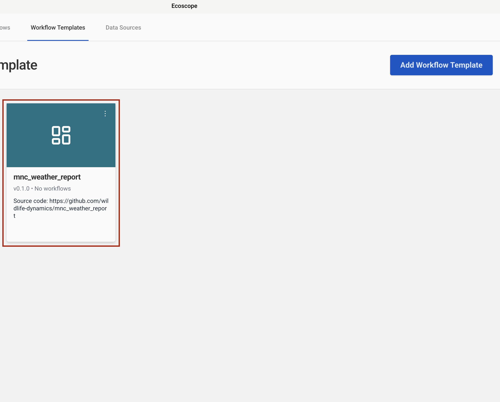

# MNC Weather Report — User Guide

This guide walks you through configuring and running the MNC Weather Report workflow, which retrieves weather station observations from EarthRanger and produces daily summary tables and interactive time-series charts for seven meteorological variables.

---

## Overview

The workflow delivers, for each run:

- **1 daily weather summary CSV** — precipitation, temperature, wind speed, wind gusts, soil temperature, relative humidity, and atmospheric pressure aggregated per weather station and date
- **7 line charts (HTML + PNG)** — one per meteorological variable, coloured by weather station, covering the full analysis time range

---

## Prerequisites

Before running the workflow, ensure you have:

- Access to an **EarthRanger** instance with weather station observations recorded under the subject group **ER2ER - From GMMF** for the analysis period

---

## Step-by-Step Configuration

### Step 1 — Add the Workflow Template

In the workflow runner, go to **Workflow Templates** and click **Add Workflow Template**. Paste the GitHub repository URL into the **Github Link** field:

```
https://github.com/wildlife-dynamics/mnc_weather_report.git
```

Then click **Add Template**.


---

### Step 2 — Configure the EarthRanger Connection

Navigate to **Data Sources** and click **Connect**, then select **EarthRanger**. Fill in the connection form:

| Field | Description |
|-------|-------------|
| Data Source Name | A label to identify this connection (e.g. `Mara North Conservancy`) |
| EarthRanger URL | Your instance URL (e.g. `your-site.pamdas.org`) |
| EarthRanger Username | Your EarthRanger username |
| EarthRanger Password | Your EarthRanger password |

> Credentials are not validated at setup time. Any authentication errors will appear when the workflow runs.

Click **Connect** to save.


---

### Step 3 — Select the Workflow

After the template is added, it appears in the **Workflow Templates** list as **mnc_weather_report**. Click the card to open the workflow configuration form.



---

### Step 4 — Configure Workflow Details, Time Range, and EarthRanger Connection

The configuration form has three sections on a single page.

**Set workflow details**

| Field | Description |
|-------|-------------|
| Workflow Name | A short name to identify this run |
| Workflow Description | Optional notes (e.g. reporting month or site) |

**Time range**

| Field | Description |
|-------|-------------|
| Timezone | Select the local timezone (e.g. `Africa/Nairobi UTC+03:00`) |
| Since | Start date and time — weather observations from this point are fetched |
| Until | End date and time of the analysis window |

**Connect to ER**

Select the EarthRanger data source configured in Step 2 from the **Data Source** dropdown (e.g. `Mara North Conservancy`).

Once all three sections are filled, click **Submit**.


---

## Running the Workflow

Once submitted, the runner will:

1. Fetch all observations from the subject group **ER2ER - From GMMF** for the analysis period.
2. Extract seven meteorological variables from each observation's JSON detail field: precipitation, surface air temperature, wind speed, wind gusts, soil temperature, relative humidity, and atmospheric pressure.
3. Compute daily aggregates per weather station — summing precipitation and averaging or maximising each remaining variable.
4. Persist the daily summary as `weather_summary_table.csv`.
5. Draw seven interactive line charts (one per variable), coloured by weather station.
6. Convert all seven charts to PNG at 1 280 × 720 px (2× scale).
7. Save all outputs to the directory specified by `ECOSCOPE_WORKFLOWS_RESULTS`.

---

## Output Files

All outputs are written to `$ECOSCOPE_WORKFLOWS_RESULTS/`.

| File | Description |
|------|-------------|
| `weather_summary_table.csv` | Daily per-station summary: sum precipitation, mean temperature / wind / humidity / pressure, max gusts |
| `precipitation_readings_over_time.html` / `.png` | Daily total precipitation (mm) per weather station |
| `temperature_readings_over_time.html` / `.png` | Daily mean surface air temperature (°C) per weather station |
| `wind_speed_readings_over_time.html` / `.png` | Daily mean wind speed per weather station |
| `wind_gusts_readings_over_time.html` / `.png` | Daily maximum wind gusts per weather station |
| `soil_temperature_readings_over_time.html` / `.png` | Daily mean soil temperature (°C) per weather station |
| `relative_humidity_readings_over_time.html` / `.png` | Daily mean relative humidity per weather station |
| `atmospheric_pressure_readings_over_time.html` / `.png` | Daily mean atmospheric pressure per weather station |
